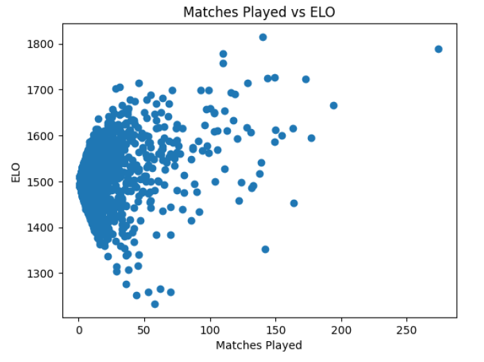

# Super Smash Bros. Melee Match Predictor

## Overview

This project explores the development of a machine learning–based predictor for **Super Smash Bros. Melee** match outcomes. The goal is to determine whether player history, character choice, and matchup trends can be leveraged to produce accurate and stable predictions for competitive matches.

Over the course of the project, I experimented with multiple model architectures, gradually increasing complexity and refining performance through iteration and tuning.

---

## Data & Feature Engineering

The dataset consists of historical Super Smash Bros. Melee match data, which was processed to extract several key features:

- Player win rates  
- Character selections  
- Stage information  
- Player identity embeddings  
- ELO ratings per player  

To better understand and validate the data, I generated several visualizations, including:

- Player win rate distributions  
- ELO calculations and progression per player  
- Exploratory graphs used to evaluate data balance and signal strength  

These graphs helped guide feature selection and provided intuition for how much predictive signal existed before modeling.

### Player Win Rate Distribution

### Elo Calculation

### Matches Played

### Top 5 Players Elo History

---

## Model Iterations

### Baseline Embedding Model

The first model was a fully connected neural network that takes in parameters such as player win rate, selected characters, and player identities. The model learns embeddings for players, characters, and stages, and uses these embeddings to predict the outcome of a match.

While training was somewhat unstable, this model still performed reasonably well, reaching a peak accuracy of approximately **68%**. This suggested that the learned embeddings were capturing meaningful relationships between players and matchups.

---

### GRU-Based Temporal Model

To incorporate historical context, I next implemented a **GRU-based model** designed to learn from previous matchups between players. Rather than treating each match independently, this model attempted to capture temporal patterns in player performance.

Although this approach reduced training loss, it appeared to overfit the data. Despite strong performance on the training set, it ultimately produced slightly worse predictions on unseen matches compared to the baseline embedding model.

---

### Hybrid GRU + Fully Connected Model

To balance temporal learning with model stability, I designed a **hybrid architecture**:

- A GRU processes sequences of previous match embeddings  
- The GRU output is then passed into a fully connected network similar to the baseline model  

This approach allowed the model to leverage matchup history without fully relying on the GRU for prediction.

After implementing the hybrid model, I performed a **hyperparameter grid search** to fine-tune learning rates, embedding sizes, and hidden dimensions. With these adjustments, the model achieved more consistent results, stabilizing between **68–71% accuracy**.

---

## Results

- Best-performing model: Hybrid GRU + Fully Connected Network  
- Accuracy range: **68–71%**  
- Improved stability compared to earlier models  
- Evidence that both embeddings and limited temporal context contribute meaningful signal  

---

## Open Questions & Future Work

Several questions remain open and point toward future improvements:

- Is the current performance ceiling driven by inherent randomness in Melee, or by missing features?
- Would additional contextual data (e.g., tournament type, player playstyle, recent form) improve predictions?
- Can temporal information be incorporated more effectively without causing overfitting?
- Would a larger dataset or stronger regularization techniques improve generalization?

These questions define clear next steps for extending the project and further refining the predictor.

---

## Notes

This project was built as an exploration of model architecture tradeoffs, feature representation, and generalization in a noisy, real-world competitive domain.
